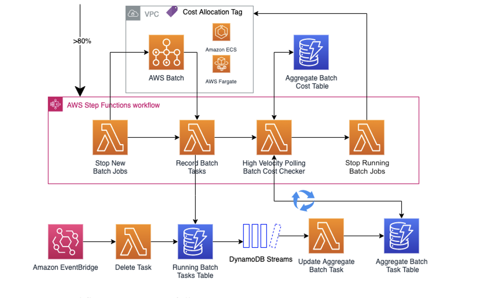

# Welcome to the Serverless Batch Cost Guardian CDK Python project!

This is a serverless solution that watches jobs in an AWS Batch (Fargate-only) compute 
environment, and if an AWS Budget threshold is close to being met, will kick 
in a high-frequency cost checker to stop all jobs before the budget is met. This 
solution is meant to be a safeguard for long-running jobs and can evaluate Budget status
at a much higher rate than AWS Billing's 2-3 daily limit with 6-8 hour granularity. 

This deployment guide assumes you have familiarity with the AWS Cloud Development Kit (CDK). If you 
are unfamiliar with the CDK, please refer to this documentation: https://docs.aws.amazon.com/cdk/v2/guide/getting_started.html.

## Architecture:

The architecture can be broken into two parts: the Event-Driven Budget Checker and the Serverless Batch Cost Guardian. 
The former is shown below. It leverages AWS Budgets to proactively monitor your Batch Compute Environment's spend 
via a Cost Allocation Tag. When the Budget threshold is close to being met (the threshold percentage is configurable by 
the user as a CDK parameter), it will kick in the Serverless Batch Cost Guardian.


The Serverless Batch Cost Guardian, shown below, is a AWS Step Functions workflow that stops new jobs from being submitted, 
tracks near-real time spend of the existing jobs, and can terminate jobs once the Budget is reached. It does this through a 
collection of Lambda functions and DyanmoDB tables. The period between cost checks is configurable by the user. 



## Prerequisites:

1. If already using AWS Batch, identify a Fargate Compute Environment to monitor. 
If you do not have one, please deploy a test Batch environment via the "sample-batch-env" 
CDK stack provided in this repository (Instructions under Deployment). Make sure to run a 
quick "hello-world" job via the provided job defintion. This will trigger the creation of 
an AWS-Generated Cost Allocation Tag for the Batch Compute Environment.

2. Create a Cost and Usage Report (CUR) and accompanying S3 bucket to deliver the CUR to. 
You can follow these instructions to do so: https://docs.aws.amazon.com/cur/latest/userguide/cur-create.html.
When configuring your CUR, please make sure to set the Report path prefix as "reports", set the Granularity to 
Hourly, and for Report versioning, create new report version.

3. In AWS Billing, activate the following AWS-Generated Cost Allocation Tags: "aws:batch:compute-environment", 
"aws:batch:job-definition", and "aws:batch:job-queue". If they are not yet present, this is ok. Please wait up to 24 
hours for them to appear after running the "hello-world" job as stated in Prerequisites 1.

4. Finally, make the AWS Budget to be used by the Event-Driven Budget Checker CDK stack. You can follow these
instructions to do so: https://docs.aws.amazon.com/cost-management/latest/userguide/budgets-create.html#create-cost-budget.
Make sure to select Cost budget, and you can keep the default settings. Name your budget appropriately and set an amount.
After that, you will select the "Filter specific AWS cost dimensions" under Budget Scope. Under Filters, select Tag from the
Dimension dropdown. Under the Tag dropdown, choose the "aws:batch:compute-environment" from Prerequisite 3. 
If the tag is not appearing, please wait up to an additional 24 hours. This will give the tag time to propagate and appear on
a CUR report. Once the tag appears, under the Values dropdown, select the name of the Batch Compute Environment from
Prerequisite 1.

## Deployment:

### Sample Batch Environment 

If you do not have a prexisting AWS Batch Fargate Compute Environment, follow these steps as part of the Prerequisites 
before moving forward. Refer to the "Boilerplate CDK instructions" section below to bootstrap your environment. After that, 
please run the following CDK command to create your Fargate Batch Compute Environment. 

```
cdk deploy sample-batch-env-batch-stack
```

### Event-Driven Budget Checker

Please run the following command to deploy the Event-Driven Budget Checker. You will need to replace the parameters with your 
specific values obtained by the Prerequisites. 

The "budgetName", "batchComputeEnvName", and "s3CurBucketName" can all be taken from the Prerequisites you performed above. 
The "desiredBudgetThresholdPercent" can be entered as a numerical percent, e.g. 50. Based on how aggressive you would like to be 
in preventing Batch overspend, you can set the threshold lower. The "costGuardianStateMachineArn" should be left blank. We will 
return back to this this parameter after running the Serverless Batch Cost Guardian CDK stack.

```
cdk deploy event-driven-budget-checker-budget-stack \
    --parameters snsEmail=<YOUR-EMAIL> \
    --parameters accountId=<YOUR-AWS-ACCOUNT-ID> \
    --parameters budgetName=<NAME-OF-AWS-BUDGET> \
    --parameters batchComputeEnvName=<NAME-OF-BATCH-COMPUTE-ENVIRONMENT> \
    --parameters costGuardianStateMachineArn= \
    --parameters desiredBudgetThresholdPercent=<DESIRED-BUDGET-THRESHOLD-PERCENTAGE> \
    --parameters s3CurBucketName=<S3-BUCKET-NAME-COST-AND-USAGE-REPORT>
```

### Serverless Batch Cost Guardian

Please run the following command to deploy the Serverless Batch Cost Guardian. You will need to replace the parameters with your 
specific values obtained by the Prerequisites. 

The "batchComputeEnvName", "batchJobQueueName", and "ecsClusterArn" can all be taken from the 
Prerequisites you performed above. However, the ECS Cluster ARN will need to be obtained by selecting the Batch Compute Environment
in the AWS Console. NOTE: Please make sure to copy the ARN, starting with "arn:xxx", not the hyperlink to the ECS cluster page
beginning with "https:xxx". The "waitTime" parameter can be any value of your choosing, just make sure to enter it in seconds.

```
cdk deploy serverless-batch-cost-guardian-guardian-stack \
    --parameters batchComputeEnvName=<NAME-OF-BATCH-COMPUTE-ENVIRONMENT> \
    --parameters batchJobQueueName=<NAME-OF-BATCH-JOB-QUEUE> \
    --parameters ecsClusterArn=<ARN-OF-BATCH-COMPUTE-ENV-ECS-CLUSTER> \
    --parameters waitTime=<TIME-BETWEEN-CHECKS-IN-SECONDS>
```

After successfully deploying the Serverless Batch Cost Guardian, please go to the newly created AWS Step Functions 
State Machine and copy its ARN.

Then, re-run the following CDK deploy command to create a linkage between the Event-Driven Budget Checker and the 
Serverless Batch Cost Guardian.

```
cdk deploy event-driven-budget-checker-budget-stack \
    --parameters costGuardianStateMachineArn=<ARN-OF-STEP-FUNCTIONS-STATE-MACHINE>
```

The above command will not re-deploy the Event-Driven Budget Checker, but instead will perform a CloudFormation 
ChangeSet operation to just update the Event-Driven Budget Checker Lambda function environment variable with the 
Serverless Batch Cost Guardian Step Functions State Machine ARN.

## Testing:

You are now ready to test the solution! If you have deployed the pervious stacks above, the solution is 
already fully-operational. However, if you'd like to see it in action immediately, you can manually trigger 
the Lambda function instead of waiting for a CUR report to trigger an S3 Lambda event. 

You will first need to temporarily update your AWS Budget amount to something very small (say $0.01) so you are not 
waiting too long. If you specified a "waitTime" parameter in the Serverless Batch Cost Guardian longer than a few seconds, 
I recommend updating that to be small, too (say 5). NOTE: You can run ```cdk deploy serverless-batch-cost-guardian-guardian-stack --parameters waitTime=5 ``` 
as shown above to perform a quick ChangeSet operation. 

After updating those two values, you will submit a Batch job to your monitored Batch Compute Environment's Job Queue. You can even 
submit multiple jobs to see the aggregated metrics (vCPU and Memory) being tracked. Please leverage the job definition provided in the
Sample Batch Environment stack to submit a simple, testing job. To do so, go to the Job Definition in the AWS Batch Console. Click 
on the "Submit New Job" button on the top right of the page. After naming the job and choosing the appropriately job 
queue from the dropdown, please enter the following bash command under Job configuration: ```sleep 10000```. Make note of the 
vCPU and Memory; the defaults of 1 vCPU and 2 GB are fine. Then click submit. (Clone this job if you'd like to see multiple).

You will then trigger the Event-Driven Budget Checker Lambda function. Please go to the AWS Lambda console and find the function
with "monthtodatebatchspend" in the name. Click on it, and press the "Test" button. A basic test event will be fine for this test.
This test event will simulate an S3 Lambda event triggered by a CUR creation in your account. The Lambda invocation will trigger 
the "serverlessbatchcostguardianstatemachine".

Go to the Step Functions Console and click on this state machine. You should see an execution of the state machine in Running state.
Click on it to see the workflow in action.  

## Reset the Solution:

Upon completion of the workflow, you should reset the two values you modified above. Either after testing the soltuion in the step above 
or after a new AWS Billing period cycle begins, you will need to reset the solution. 

To reset the solution, you will need to:

1. Re-enable both the Batch Compute Environment and the Batch Job Queue. Part of the Serverless Batch Cost Guardian Step Function workflow
was to disable them from accepting new jobs. You can re-enable them by selecting them in the AWS Batch Console and pressing "Enable" at
the top right of the page.

2. Delete the DyanmoDB metric and cost tracking items from the previous cycle. There are three tables, all with the following string
name: "serverless-batch-cost-guardian-guardian-stack". For each table, delete the singular item.

## Cost Considerations/Tradeoffs:

The main cost tradeoff of the solution is the configurability of both the AWS Budget threshold and the waitTime frequency. If you
set the AWS Budget theshold to be high, you have a higher exposure to potentially overspending on AWS Batch. This is because the 
Budget threshold is only evaluated whenever AWS Billing publishes a new CUR to your account. Say you have spent 79% of your Budget, 
with a threshold of 80%. A CUR report is created. The Serverless Batch Cost Guardian will not be invoked. But in the subsequent 6-8 hours
between the next CUR being published, you could easily have gone over your Budget. 

With a smaller Budget threshold, you should also configure a longer waitTime frequency. This is to ensure your are not incurring
excessive Lambda and Step Functions cost. You can easily set a waitTime frequency of 20 minutes (1200 seconds) and not go over Step
Functions' 4000 Free Tier state transitions in the month. * (24 hours/day * 5 transitions/hour * 30 days = 3600)

## Extensibility:

While this solution is currently presented as a tool for just AWS Fargate Batch Compute Environments, one can modify the pricing formula
in the Lambda function containing "highvelocitybatchspend" in the name (part of the Serverless Batch Cost Guardian CDK stack). We 
chose to start with Fargate Batch because of the simplified pricing economics only requiring vCPU hours spent + GB of memory used.
However, we envision users inputting their own pricing formulas and rates (programmatically accessible through the AWS Price List API).

In addition to inputting a custom price formula, users can also create a customized Cost Allocation tag to be tracked by AWS Budgets.
This is a very simple excercise and can applied to any taggable resource in AWS. 

## Boilerplate CDK Instructions:

The `cdk.json` file tells the CDK Toolkit how to execute your app.

This project is set up like a standard Python project.  The initialization
process also creates a virtualenv within this project, stored under the `.venv`
directory.  To create the virtualenv it assumes that there is a `python3`
(or `python` for Windows) executable in your path with access to the `venv`
package. If for any reason the automatic creation of the virtualenv fails,
you can create the virtualenv manually.

To manually create a virtualenv on MacOS and Linux:

```
python3 -m venv .venv
```

After the init process completes and the virtualenv is created, you can use the following
step to activate your virtualenv.

```
source .venv/bin/activate
```

If you are a Windows platform, you would activate the virtualenv like this:

```
.venv\Scripts\activate.bat
```

Once the virtualenv is activated, you can install the required dependencies.

```
pip install -r requirements.txt
```

At this point you can now synthesize the CloudFormation template for this code.

```
cdk synth
```

To add additional dependencies, for example other CDK libraries, just add
them to your `setup.py` file and rerun the `pip install -r requirements.txt`
command.

## Useful commands

 * `cdk ls`          list all stacks in the app
 * `cdk synth`       emits the synthesized CloudFormation template
 * `cdk deploy`      deploy this stack to your default AWS account/region
 * `cdk diff`        compare deployed stack with current state
 * `cdk docs`        open CDK documentation

